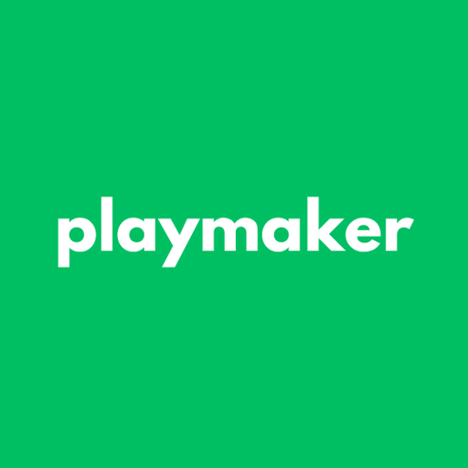

# 📄 Playmaker Field Partnership Contract

## Overview

This is a professional, bilingual (Arabic) contract for field partnerships with Playmaker platform.

---

## 📁 File Locations

### **RECOMMENDED: Professional Version (Latest)**
```
assets/contracts/field_partnership_contract_professional.html
```
**Features:** 
- ✅ 4 pages (2 Arabic + 2 English)
- ✅ Professional design (NO emojis/icons)
- ✅ Detailed Camera Article (7 comprehensive clauses)
- ✅ Daily payment terms
- ✅ Enhanced signature boxes
- ✅ Print-optimized (all articles visible)

### Previous Versions
```
assets/contracts/field_partnership_contract_ar_en.html
```
**Features:** 4 pages with emojis (not recommended for professional use)

```
assets/contracts/field_partnership_contract_ar.html
```
**Features:** 2 pages, Arabic only (original version)

---

## ✨ Features

### Design (Latest Version)
- ✅ Beautiful gradient design with Playmaker green branding
- ✅ Professional 4-page A4 format (2 Arabic + 2 English)
- ✅ Playmaker logo integration
- ✅ Watermark background for authenticity
- ✅ Modern, clean layout
- ✅ **Enhanced signature boxes** with proper spacing and borders
- ✅ Prominent time input boxes for each weekday

### Content (Bilingual - Arabic & English)
- 📋 Complete partnership agreement in both languages
- 💰 Commission-based model explanation
- ⚡ **Daily payment terms** (NEW) - Payments settled daily
- 📹 Camera installation terms (15,000 EGP)
- 📅 **Prominent weekly schedule table** (Sunday-Saturday) with clear input boxes
- ✍️ **Professional signature boxes** with dedicated areas for:
  - Full name field
  - Large signature area (70px height)
  - Date field
  - Stamp/seal area (65px height)
- ⚖️ Legal terms and conditions
- 🌍 Side-by-side Arabic and English versions

### Fillable Fields
- Date of agreement
- Field owner information (name, ID, phone, address)
- Playmaker representative information
- Commission percentage
- Weekly time slots for each day
- Signature areas with proper spacing

---

## 🖨️ How to Use

### Method 1: Print and Fill by Hand
1. Open `field_partnership_contract_ar.html` in a web browser
2. Print to paper (A4 size)
3. Fill in the blank fields by hand
4. Sign both pages

### Method 2: Fill Digitally (Recommended)
1. Open the HTML file in a web browser
2. Use browser's "Inspect Element" to edit text
3. Print to PDF
4. Sign electronically or print and sign

### Method 3: Use PDF Editor
1. Print HTML to PDF first
2. Open in PDF editor (Adobe Acrobat, Preview, etc.)
3. Fill in the fields
4. Save and send

---

## 📋 Information to Fill

### Page 1

**Date Section:**
- Day, Month, Year

**Parties Table:**
- Field Owner: Name, National ID, Phone, Address
- Playmaker Rep: Name, National ID, Phone, Address

**Commission Rate:**
- Percentage (e.g., 85%)
- Amount per booking (e.g., 255 EGP if booking is 300 EGP)

**Weekly Schedule Table:**
For each day (Sunday-Saturday):
- Start time (e.g., 08:00)
- End time (e.g., 23:00)

### Page 2

**Additional Terms:**
- Review and understand all clauses

**Signature Boxes:**
- Field Owner: Name, Signature, Date, Stamp (if applicable)
- Playmaker Rep: Name, Signature, Date, Official Stamp

---

## 🎨 Customization

### Change Colors
Edit the CSS in the `<style>` section:
```css
/* Main brand color */
background: linear-gradient(135deg, #00BF63 0%, #00A055 100%);

/* Change to your preferred color */
background: linear-gradient(135deg, #YOUR_COLOR 0%, #YOUR_COLOR_DARK 100%);
```

### Change Logo
Replace the image path:
```html

```

### Add/Remove Fields
Duplicate or remove input boxes:
```html
<span class="input-box"></span>
```

---

## 📱 Integrate with Admin App

You can add a "Generate Contract" feature in the admin app:

### Option 1: WebView
```dart
import 'package:flutter/material.dart';
import 'package:webview_flutter/webview_flutter.dart';

class ContractScreen extends StatelessWidget {
  @override
  Widget build(BuildContext context) {
    return Scaffold(
      appBar: AppBar(title: Text('Partnership Contract')),
      body: WebView(
        initialUrl: 'assets/contracts/field_partnership_contract_ar.html',
        javascriptMode: JavascriptMode.unrestricted,
      ),
    );
  }
}
```

### Option 2: Open in Browser
```dart
import 'package:url_launcher/url_launcher.dart';

Future<void> openContract() async {
  final url = 'file:///path/to/assets/contracts/field_partnership_contract_ar.html';
  if (await canLaunch(url)) {
    await launch(url);
  }
}
```

### Option 3: PDF Generation (Advanced)
Use `pdf` package to generate PDF programmatically with filled data.

---

## 📧 Sharing the Contract

### Email Template
```
Subject: Partnership Agreement - Playmaker

Dear [Field Owner Name],

Please find attached the partnership agreement between Playmaker and [Field Name].

Review the contract carefully and fill in the required information. Once signed, please scan and send back to us.

Key Points:
- Commission: [X]% per booking
- Camera installation: 15,000 EGP
- Contract duration: 1 year
- Payment: Monthly/Weekly settlement

If you have any questions, please contact us.

Best regards,
Playmaker Team
```

---

## ⚖️ Legal Notes

- This contract is in Arabic and follows Egyptian law
- Camera installation cost: 15,000 EGP (paid by field owner)
- Commission-based model (specify percentage)
- 1-year duration with 14-day termination notice
- Both parties must sign on both pages

---

## 🔒 Important Terms Included

1. **Commission System**: Clear percentage and calculation example
2. **Camera Terms**: Installation, cost, and privacy
3. **Booking Management**: Real-time updates required
4. **Quality Standards**: Clean facilities, lighting, proper surface
5. **Complaint Handling**: 48-hour investigation period
6. **Termination**: 14-day written notice required
7. **Governing Law**: Egyptian law

---

## 📊 Contract Checklist

Before signing, ensure:
- [ ] All fields are filled
- [ ] Commission percentage is agreed upon
- [ ] Weekly schedule is complete
- [ ] Camera terms are understood (15,000 EGP)
- [ ] Both parties have read all terms
- [ ] Contact information is correct
- [ ] Both pages are signed
- [ ] Date is filled on both signature boxes
- [ ] Stamps/seals are applied (if applicable)
- [ ] Copy provided to each party

---

## 🌐 Languages

**Current:** Arabic (RTL)

**Future Versions:**
- English version can be created by translating text
- Keep same structure and styling
- Change `dir="rtl"` to `dir="ltr"` for English

---

## 🛠️ Technical Details

- **Format**: HTML/CSS
- **Page Size**: A4 (210mm × 297mm)
- **Direction**: RTL (Right-to-Left) for Arabic
- **Print Ready**: Yes (uses `@page` and `@media print`)
- **Responsive**: Optimized for desktop/print
- **Browser Support**: All modern browsers

---

## 📞 Support

For contract questions or modifications, contact:
- **Technical**: Development team
- **Legal**: Legal department
- **Business**: Partnership team

---

**Version**: 1.0  
**Last Updated**: January 2025  
**Language**: Arabic  
**Status**: Production Ready ✅

